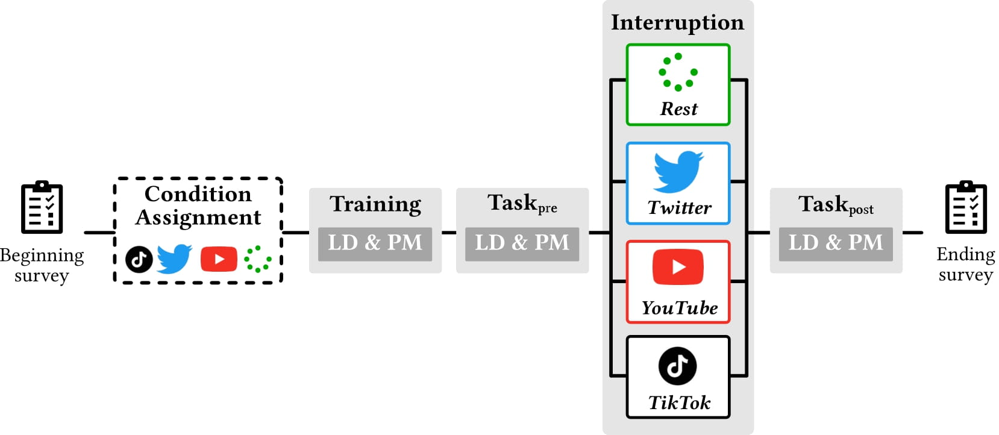

# [Short-Form Videos Degrade Our Capacity to Retain Intentions: Effect of Context Switching On Prospective Memory](./chiossi2023short.pdf)

Francesco Chiossi, Luke Haliburton, Changkun Ou, Andreas Butz, Albrecht Schmidt<br/>
In the 2023 ACM Conference on Human-Computer Interaction (CHI'23). ACM, New York, NY, USA, 15 pages. https://doi.org/10.1145/3544548.3580778

Social media platforms use short, highly engaging videos to catch users' attention. While the short-form video feeds popularized by TikTok are rapidly spreading to other platforms, we do not yet understand their impact on cognitive functions. We conducted a between-subjects experiment (N=60) investigating the impact of engaging with TikTok, Twitter, and YouTube while performing a Prospective Memory task (i.e., executing a previously planned action). The study required participants to remember intentions over interruptions. We found that the TikTok condition significantly degraded the users’ performance in this task. As none of the other conditions (Twitter, YouTube, no activity) had a similar effect, our results indicate that the combination of short videos and rapid context-switching impairs intention recall and execution. We contribute a quantified understanding of the effect of social media feed format on Prospective Memory and outline consequences for media technology designers to not harm the users’ memory and wellbeing.



## Full Paper

The paper is available in [chiossi2023short.pdf](./chiossi2023short.pdf).

## Data frame

- The [./data/rt.csv](./data/rt.csv) provides the data frame of reaction times.
- The [./data/acc.csv](./data/acc.csv) provides the data frame of reaction accuracy scores.
- The [./data/q.csv](./data/q.csv) provides the data frame collected from questionnaires.
- The [./data/ddm.csv](./data/ddm.csv) is the learned DDM features using [./appendix2_ddm_fitting.ipynb](./appendix2_ddm_fitting.ipynb), which is then used in [./3.ddm_anova.ipynb](./3.ddm_anova.ipynb).

## Figures

All figures appeared in the paper are placed in [./figures](./figures) and can be reproduced using `*_vis.ipynb` files.

## Analysis

The included Jupyter Notebooks for the analysis reproduces the entire Section 4 of the paper:

- [1.1.response_accuracy.ipynb](./1.1.response_accuracy.ipynb) preprocesses the raw data and computes the accuracy scores.
- [1.2.response_accuracy_lmm.ipynb](./1.2.response_accuracy_lmm.ipynb) reproduces Section 4.1.1 of the paper.
- [2.response_accuracy_vis.ipynb](./2.response_accuracy_vis.ipynb) reproduces Figure 3 and 4 of the paper.
- [3.ddm_anova.ipynb](./3.ddm_anova.ipynb) reproduces Section 4.1.3 and Table 1 of the paper.
- [4.ddm_feature_vis.ipynb](./4.ddm_feature_vis.ipynb) reproduces Figure 5 of the paper.
- [5.ddm_tiktok_vis.ipynb](./5.ddm_tiktok_vis.ipynb) reproduces Figure 6 of the paper.
- [6.questionnaire_bayes_factor.ipynb](./6.questionnaire_bayes_factor.ipynb) reproduces Section 4.2 of the paper.
- [appendix1_reaction_time_model_selection_glmm.ipynb](./appendix1_reaction_time_model_selection_glmm.ipynb) additionally explores the reaction time data using a GLMM model.
- [appendix2_ddm_fitting.ipynb](./appendix2_ddm_fitting.ipynb) fits the DDM model to the reaction time data and produces the learned DDM features as [data/ddm.csv](./data/ddm.csv).

## Contribute

The easiest way to contribute is to provide feedback! We would love to hear what you think. Please write to [francescochiossi93@gmail.com](mailto:francescochiossi93@gmail.com) and [research@changkun.de](mailto:research@changkun.de) for closer communication.

## Licenses and Citation

Copyright &copy; 2023. [LMU Munich Media Informatics Group](https://www.medien.ifi.lmu.de). All rights reserved.

The [dataset](./data) itself, available in [Creative Commons Public Domain Dedication (CC-0)](https://creativecommons.org/share-your-work/public-domain/cc0/), represented the results from consented anonymous participants and was collected by Martina Gluderer and Francesco Chiossi. The contained "source code" (i.e., Python scripts and Jupyter Notebooks) of this work is made available under the terms of [GNU GPLv3](./LICENSE).

If you find our research is helpful, we would appreciate a citation via:

```bibtex
@inproceedings{chiossi2023memory,
	title        = {Short-Form Videos Degrade Our Capacity to Retain Intentions: Effect of Context Switching On Prospective Memory},
	author       = {Francesco Chiossi, Luke Haliburton, Changkun Ou, Andreas Butz, Albrecht Schmidt},
	year         = 2023,
	booktitle    = {ACM Conference on Human-Computer Interaction},
	publisher    = {Association for Computing Machinery},
	address      = {Hamburg, Germany},
	series       = {CHI '23},
	doi          = {10.1145/3544548.3580778},
}
```
